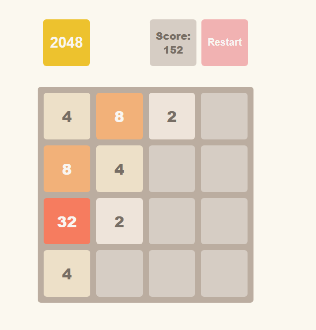

# 🎮 2048 — Classic Puzzle Game in JavaScript

A fully functional and responsive implementation of the legendary 2048 puzzle game.
Challenge yourself by merging tiles, reaching 2048, and mastering the mechanics behind every move.

## 🧩 Gameplay & Demo

- 🎮 **4×4 grid puzzle** — merge equal tiles to reach 2048
- 🎯 **Score tracking** — live update with every merge
- 🔄 **Restart anytime** — reset the game with a single click
- 📦 **Local logic implementation** — no external libraries used

## 🖼️ Screenshot



## 🛠️ Technologies Used

- **HTML5** — base markup structure
- **CSS3** — grid layout, animations, and styles
- **JavaScript (ES6+)** — full game logic and user input handling
- **BEM Methodology** — for consistent and scalable styles
- **Event Listeners** — for keyboard interaction
- **Class-based Architecture** — game logic via `Game` class

## ✨ Features

- ⬅️➡️⬆️⬇️ **Keyboard Controls** — intuitive movement using arrow keys
- 🔢 **Random Tile Generation** — with 2 or 4 value probability logic
- 🔗 **Tile Merging Rules** — no double merges per move
- 🎉 **Win Detection** — notifies when 2048 tile appears
- 🧱 **Game Over Detection** — alerts if no moves left
- 🕹️ **Dynamic Start/Restart** — UI updates based on game state
- 🧮 **Scoring System** — sum of merged tiles per move

## 🚀 Getting Started

To run the project locally:

1. **Clone the repository**

    ```bash
    git clone https://github.com/your-username/2048-game.git
    cd 2048-game
    ```

2. **Open the game in your browser**

    You can simply open the `index.html` file:

    ```bash
    open src/index.html
    # or manually open with your preferred browser
    ```

## 📁 Project Structure Highlights

- `/src/modules/Game.class.js` — main class containing game logic:
  - `moveLeft()`, `moveRight()`, `moveUp()`, `moveDown()`
  - `getState()`, `getScore()`, `getStatus()`
  - `start()` and `restart()` methods for full control
- `/src/main.js` — handles UI rendering and DOM interactions
- `/src/index.html` — game UI with predefined CSS classes
- Supports CSS class conventions like `field-cell--%value%` for tiles
- `keydown` event listener used for capturing player moves

## 🤝 Contributing

Feel free to open issues or submit pull requests if you'd like to enhance the logic, animations, or UI!

## 📬 Contact Me

- 💬 Telegram: [@dvd5678](https://t.me/dvd5678)
- 📧 Email: [dvdmsk21@gmail.com](mailto:dvdmsk21@gmail.com)
- 💼 LinkedIn: [David Moskalenko](https://www.linkedin.com/in/david-moskalenko-0a68051b8)
